# claude-cam

**Show Claude Code something that isn't on your screen.**

You're in the terminal. The thing Claude needs to see is a wiring harness on
your desk, a 3D print that came out warped, a part number on the underside of a
router, an error on a machine that isn't this one. Screenshots can't help — it's
not on a screen. Describing it takes three paragraphs and still loses the detail
that mattered.

`claude-cam` puts your phone's camera into the session. Type `/cam`, a
viewfinder opens on your Mac, you point the phone, hit capture, and the photo is
in Claude's context. No upload dialogs, no AirDrop, no Photos.app round-trip.

```text
> /cam
PHOTOS 1
/Users/you/.claude/cam/shots/20260818-130241/01.jpg
```

## Three ways in

| Command | What happens | Use when |
|---|---|---|
| `/cam` | Live viewfinder window on the Mac, capture button | You're at your desk (default) |
| `/cam upload` or `/camqr` | QR code → phone browser → native camera | The subject is in another room or outdoors |
| `/cam now` | Silent frame grab, zero taps on the phone | The phone is mounted and already aimed |

The viewfinder is the default because it's the only one that lets you **see what
you're framing before you commit**.

## Install

```bash
git clone https://github.com/jhammant/claude-cam.git
cd claude-cam
./install.sh
```

That symlinks `skills/cam` and `skills/camqr` into `~/.claude/skills/`, so
`git pull` updates them in place. Existing skills of the same name are backed
up, never overwritten.

Optional extras:

```bash
brew install qrencode    # QR codes for /cam upload
brew install ffmpeg      # required only for /cam now
```

Python 3.9+ (stdlib only — no pip install) and the Xcode command line tools for
the viewfinder, which compiles on first run in about two seconds and is cached.

## How it works

```mermaid
flowchart LR
  L["/cam live<br/>viewfinder window"] -->|AVFoundation| P[frame]
  U["/cam upload<br/>QR to phone browser"] -->|HTTP POST| P
  N["/cam now<br/>silent grab"] -->|ffmpeg| P
  P --> S["sips<br/>HEIC to JPEG<br/>long edge 1568px"]
  S --> D["~/.claude/cam/shots/&lt;timestamp&gt;/"]
  D --> C["Claude reads the paths<br/>images enter context"]
```



Every mode converges on the same place: a timestamped folder of normalised
JPEGs whose paths get printed. The skill then tells Claude to `Read` them, which
is what actually puts pixels into the model's context.

Photos are resized to 1568px on the long edge — Claude's optimal image size —
while the full-resolution original is kept alongside in `orig/`. Nothing is
ever deleted.

## Design notes

Three things were measured rather than assumed, and each one changed the design:

- **Continuity Camera cold start is ~40 seconds**, not instant. A sleeping
  iPhone has to wake and negotiate before it delivers a frame. Once warm it's
  about 5 seconds. That's why the silent grab isn't the default.
- **You cannot frame a shot you can't see.** The first hands-free capture came
  back pure black because the phone was face-down on the desk. The viewfinder
  exists entirely because of that failure.
- **A self-timer must count from the first frame, not from launch.** Counting
  from launch fires into an empty buffer on a cold camera and captures nothing.

## Security

The upload server binds `0.0.0.0` so your phone can reach it, but every route is
behind a random token persisted in `~/.claude/cam/token`. Requests without it
get a 404. The server self-terminates after an hour idle. Nothing is uploaded
anywhere off your machine — the photo goes phone → your Mac → the session.

## Requirements

- macOS (uses `sips` and AVFoundation)
- An iPhone for the viewfinder and silent modes — Continuity Camera must be
  working, which means same Apple ID, Wi-Fi and Bluetooth on, phone nearby
- **Any** phone with a camera and a browser for `/cam upload` — Android is fine
- [Claude Code](https://claude.com/claude-code)

## License

MIT — see [LICENSE](LICENSE).
